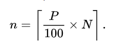

This is the [Flask](https://flask.palletsprojects.com/en/1.1.x/) web app for [calculating percentile](https://en.wikipedia.org/wiki/Percentile#The_nearest-rank_method) of a specific pool.

## Getting started
First, come to the source folder and install flask. 
By the way, if you want to use your own python environment which isolates with the general python environment in computer, let create a new one and active it before. See [python environment](https://docs.python.org/3/library/venv.html) for details

```bash
cd percentile-app/
pip install requirement
```

This will install the flask framework to your python environment. 
Now let's start the application, run the command below

```bash
py main.py
```

Now the web application will start at the port 5000

## Endpoints
We have the 2 endpoints in the application. One is append or insert data and one is calculte the percentile.

To test it easily, I prefer to use [PostMan tool]().

### First endpoint
This endpoint will post a pool to application. If the pool is already exists, it will append the pool values. If not, it will insert a new pool.

Endpoint:
```bash
http://localhost:5000/api/v1/pool
```

Method: HTTP POST

Request body example:
```json
{
	"poolId": 1,
	"poolValues": [16,15,14,13,12,11]
}
```

When posted pool is existed, the response is the string:
```bash
Apppended
```
Or when posted pool is not existed, the response is:
```bash
Inserted
```
When posted pool is not exsited

### Second endpoint
This endpoint will post an object to ask the P-th of a specific percetile in a given endpoint

Endpoint:
```bash
http://localhost:5000/api/v1/pool_indexes
```

Method: HTTP POST

Request body example:
```json
{
	"poolId": 1,
	"percentile": 40
}
```

Once success, the responsed body look like:
```json
{
    "total_count": 11,
    "value": 5
}
```

#### Note: 
In this application, I keep it sample and don't use any database connection to handle it.
The POOL_LIST is defined in the file <em>pool.py</em>

## Why Flask?
Flask is the useful framework to build lightweight application with Python backend. Also, Flask can satisfy most of demand of the backend Python.

In this project, I focus on the feature calculating percentile. So use the simple framewrok to build endpoint is the best choice.

## The normal percentile formula
My formula to calculate percentile:





Where:

<em>n</em>: The result of P-th value in list

<em>P</em>: The percentile

<em>N</em>: Number elements in the sample

Reference: https://en.wikipedia.org/wiki/Percentile#The_nearest-rank_method
## How to extend with another advance percentile formula?
### Reusable and scaleble
To make the reusable, scaleable source code, I use the 2 patterns: template method and strategy.

The class Percentile (in <em>percentile.py</em>) has responsible for handle percentile calculation. This is the abstract class has well-defined the calculation template. All of its concrete classes will implement detailed percentile calculation with their individual formulas.

Class Percentile contains method <em>get_indexes()</em>. This method defines the general process to calculate percentile and return data.
```Python
def get_indexes(self): 
	pos = self.get_pos()
	value = self.get_value()
	total_count = self.get_total_count()
	dict_res = {
		'value': value,
		'total_count': total_count
	}
	return dict_res
```

The template method pattern is applied, all methods <em>get_pos(), get_value(), get_total_count()</em> are abstract methods without definition. 

In my source code, I defined the class NormalPercentile (in <em>normal_percentile.py</em>) which is concreted class of Percentile.
This class implements methods <em>get_pos(), get_value(), get_total_count()</em> in detail way.

Once you wanna to create a new strategy to handle another percentile formulas. You can define a new concreted class of Percentile and implement the methods <em>get_pos(), get_value(), get_total_count()</em>. 

### Avoid loose couple
I create the class PercentileFactory (in <em>percentile_factory.py</em>) to produce the percentile handler. With each strategy calculated percentile we want to use, we pass the parameter <em>strategy</em> to the static method <em>create_strategy()</em>. Then it creates a new corresponding instance. We don't create instance directly in consumed class.

When define any new strategy class, don't forget to add the corresponding strategy keyword to method <em>create_strategy()</em>. Therefore, the method has availability to create your new handler. Currently, it only has checker for the <em>NormalPercentile</em>.

```python
def create_strategy(percentile, values, strategy):
	if strategy == 'basic':
		return NormalPercentile(percentile, values)
	return None
```

In the current code, the STRATEGY is configured in <em>constant.py</em>. If you want to change, let change to new strategy keyword you want.